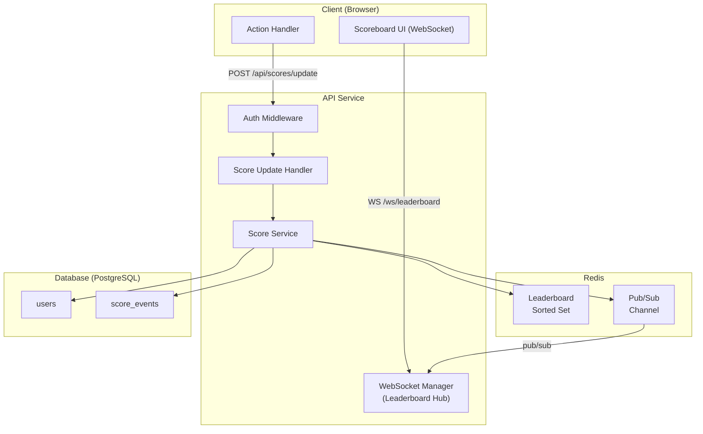
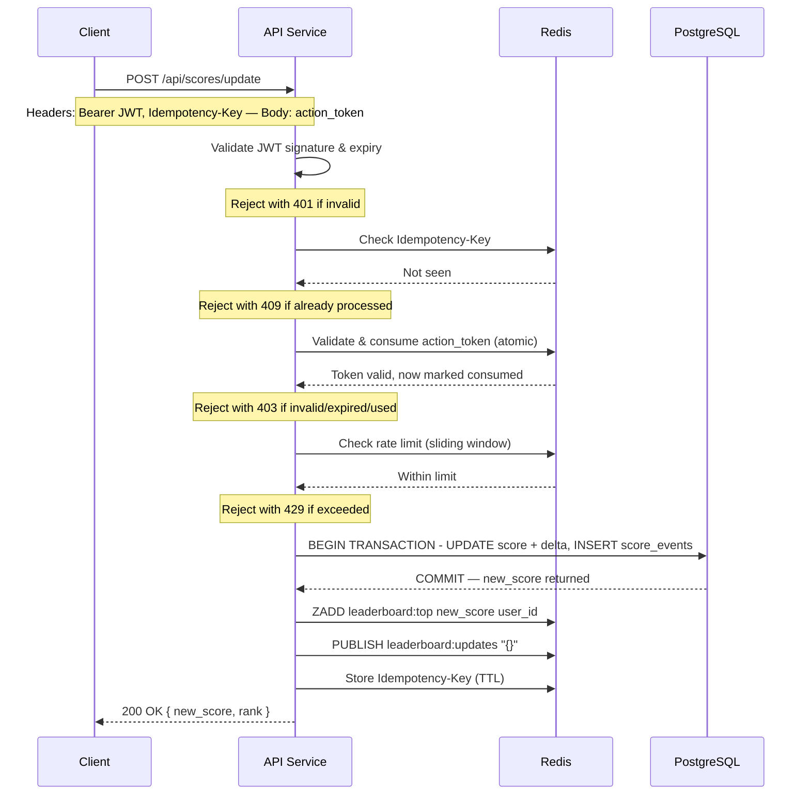
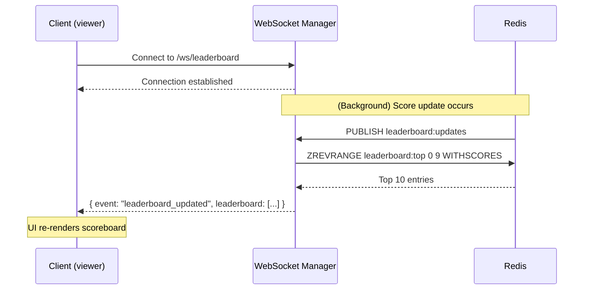

# Score Update & Live Leaderboard Module

## Overview

This document specifies the **Score Update & Live Leaderboard** module for the API service. It covers the HTTP endpoints, real-time delivery mechanism, authentication model, anti-cheat controls, and data flow. This spec is intended for the backend engineering team responsible for implementation.

---

## Table of Contents

1. [System Architecture](#system-architecture)
2. [API Endpoints](#api-endpoints)
3. [Authentication & Authorization](#authentication--authorization)
4. [Anti-Cheat & Score Integrity](#anti-cheat--score-integrity)
5. [Real-Time Leaderboard](#real-time-leaderboard)
6. [Data Models](#data-models)
7. [Flow Diagrams](#flow-diagrams)
8. [Improvement Notes](#improvement-notes)

---

## System Architecture

The module is composed of four layers that each own a distinct responsibility:

- **Client (Browser):** The Action Handler triggers a score update over REST when the user completes an action. The Scoreboard UI maintains a persistent WebSocket connection to receive live leaderboard pushes without polling.
- **API Service:** Incoming score-update requests pass through Auth Middleware (JWT validation) and then the Score Update Handler, which delegates business logic to the Score Service. The WebSocket Manager runs as a separate long-lived process, subscribed to Redis Pub/Sub, and fans out leaderboard updates to all connected clients.
- **Redis:** Serves two roles — a Sorted Set that holds the live top-10 leaderboard (updated atomically on every score change, O(log N)) and a Pub/Sub channel that decouples the HTTP request path from the WebSocket broadcast, enabling horizontal scaling across multiple API instances.
- **PostgreSQL:** The authoritative source of truth. Every score change is persisted to the `users` table and audited in `score_events`. Redis is derived from this data and can be reconciled if it becomes stale.



---

## API Endpoints

### `POST /api/scores/update`

Submitted by the client after a user completes an action. Increments the user's score and triggers a leaderboard broadcast.

**Request Headers**

| Header          | Required | Description                         |
|-----------------|----------|-------------------------------------|
| `Authorization` | Yes      | `Bearer <JWT access token>`         |
| `Content-Type`  | Yes      | `application/json`                  |
| `Idempotency-Key` | Yes    | UUID v4 — prevents duplicate submissions |

**Request Body**

```json
{
  "action_token": "string"
}
```

| Field          | Type   | Description                                                        |
|----------------|--------|--------------------------------------------------------------------|
| `action_token` | string | A short-lived, signed token issued by the server when the action was initiated. Proves the action was server-acknowledged. |

**Response — 200 OK**

```json
{
  "new_score": 1450,
  "rank": 3
}
```

**Error Responses**

| Status | Code                  | Meaning                                      |
|--------|-----------------------|----------------------------------------------|
| 401    | `UNAUTHORIZED`        | Missing or invalid JWT                       |
| 403    | `FORBIDDEN`           | Action token invalid, expired, or already used |
| 409    | `DUPLICATE_REQUEST`   | Idempotency key already processed            |
| 429    | `RATE_LIMITED`        | Too many score updates from this user        |
| 500    | `INTERNAL_ERROR`      | Server-side failure                          |

---

### `GET /api/leaderboard`

Returns the current top-10 snapshot. Used for initial page load before the WebSocket connection is established.

**Response — 200 OK**

```json
{
  "leaderboard": [
    { "rank": 1, "user_id": "u_abc", "display_name": "Alice", "score": 9800 },
    { "rank": 2, "user_id": "u_def", "display_name": "Bob",   "score": 8750 }
  ],
  "updated_at": "2026-04-04T10:00:00Z"
}
```

---

### `WebSocket /ws/leaderboard`

Long-lived connection. The server pushes leaderboard updates whenever any top-10 score changes.

**Server → Client message**

```json
{
  "event": "leaderboard_updated",
  "leaderboard": [
    { "rank": 1, "user_id": "u_abc", "display_name": "Alice", "score": 9800 }
  ],
  "updated_at": "2026-04-04T10:00:05Z"
}
```

The client should replace its full leaderboard state on each message — no delta merging required.

---

## Authentication & Authorization

### JWT Access Tokens

- Issued at login; short-lived (15 minutes recommended).
- Contain claims: `sub` (user ID), `exp`, `iat`.
- Validated on every `POST /api/scores/update` request using the server's public key (RS256 recommended, avoids shared-secret distribution).
- The `sub` claim is used as the authoritative user identity — the request body must not carry a user ID field, preventing users from submitting scores on behalf of others.

### Action Tokens

Action tokens decouple "the server knows this action started" from "the client says the action finished". Flow:

1. When the user begins an action, the client requests an **action token** from the server (endpoint to be defined by the team handling the action feature).
2. The server creates a signed, single-use token (e.g. JWT with short TTL — 60 seconds) bound to `user_id` and `action_type`, and stores its hash in Redis.
3. Upon action completion, the client submits this token to `POST /api/scores/update`.
4. The server verifies the signature, checks expiry, and marks it consumed (removes from Redis) atomically to prevent replay.

This means a score increase can only occur if the server itself previously acknowledged the action — clients cannot fabricate score increments.

---

## Anti-Cheat & Score Integrity

| Control                    | Mechanism                                                                          |
|----------------------------|------------------------------------------------------------------------------------|
| Identity binding           | Score is applied to the JWT `sub`, not any client-supplied ID                     |
| Action proof               | Single-use action token required (see above)                                       |
| Replay prevention          | Action token consumed atomically in Redis on first use                             |
| Duplicate request guard    | `Idempotency-Key` header; processed keys cached in Redis with TTL matching token TTL |
| Rate limiting              | Max N score updates per user per minute (e.g. 10/min), enforced in middleware via Redis sliding window |
| Server-side score delta     | The score increment is defined server-side per action type — clients never send a numeric delta |
| Audit log                  | Every score event written to `score_events` table with timestamp, action token, and IP for post-hoc review |

---

## Real-Time Leaderboard

### Leaderboard Cache (Redis Sorted Set)

- Key: `leaderboard:top`
- Members: `user_id`, Score: numeric score value
- Updated atomically with `ZADD leaderboard:top <score> <user_id>` after each successful score write.
- Top 10 retrieved with `ZREVRANGE leaderboard:top 0 9 WITHSCORES` — O(log N) operation.

### Broadcast (Redis Pub/Sub)

1. After updating the sorted set, the Score Service publishes a message to Redis channel `leaderboard:updates`.
2. The WebSocket Manager subscribes to this channel.
3. On receiving a message, the WebSocket Manager fetches the current top-10 from Redis and broadcasts to all connected clients.

This keeps the broadcast fan-out decoupled from the HTTP request path and supports horizontal scaling (multiple API server instances share the same Redis pub/sub channel).

---

## Data Models

### `users` table

| Column        | Type        | Notes                      |
|---------------|-------------|----------------------------|
| `id`          | UUID (PK)   |                            |
| `display_name`| VARCHAR(64) |                            |
| `score`       | BIGINT      | Authoritative score value  |
| `created_at`  | TIMESTAMPTZ |                            |
| `updated_at`  | TIMESTAMPTZ |                            |

### `score_events` table (audit log)

| Column          | Type        | Notes                                    |
|-----------------|-------------|------------------------------------------|
| `id`            | UUID (PK)   |                                          |
| `user_id`       | UUID (FK)   | References `users.id`                    |
| `action_token`  | VARCHAR     | Hashed token used (for traceability)     |
| `delta`         | INT         | Points awarded                           |
| `score_after`   | BIGINT      | Snapshot of score post-update            |
| `ip_address`    | INET        | Client IP for audit                      |
| `created_at`    | TIMESTAMPTZ |                                          |

---

## Flow Diagrams

### Score Update Flow

When a user completes an action, the client submits a score update request. The API applies a layered defence before touching the database: it first verifies the JWT identity, then checks the Idempotency-Key to guard against network retries, then atomically validates and consumes the single-use action token to prevent replays, and finally enforces a per-user rate limit. Only after all four gates pass does the service open a database transaction to increment the score and write the audit record. On commit, it updates the Redis leaderboard sorted set and publishes a broadcast event — keeping the HTTP response and the real-time fan-out decoupled.



---

### Live Leaderboard Broadcast Flow

Connected clients never poll — they receive leaderboard updates passively via WebSocket. When a score update is committed, the Score Service publishes a message to a Redis Pub/Sub channel. The WebSocket Manager (running on every API instance) is subscribed to that channel; on receiving the event it fetches the current top-10 from the Redis Sorted Set and immediately broadcasts it to all connected clients. This design means the broadcast fan-out is completely decoupled from the HTTP request path and works correctly across multiple horizontally-scaled instances without sticky sessions.



---

## Improvement Notes

The following items are outside the minimal spec but are recommended for the team to consider during implementation:

### 1. Action Token Endpoint Ownership
The spec assumes action tokens are issued by a separate endpoint (owned by the action feature team). The score module team should coordinate on the token format (suggested: JWT signed with a shared internal secret or the same RS256 key pair) and the Redis key schema for consumed tokens to avoid namespace collisions.

### 2. Score Delta Configuration
Score increments are defined server-side per `action_type`. These should be stored in a config table or environment-backed config map rather than hardcoded, so product can adjust point values without a deployment.

### 3. WebSocket Authentication
The current spec does not require authentication for the WebSocket connection since the leaderboard is public data. If user-specific data is ever added to the broadcast (e.g., highlighting the connected user's rank), authentication should be added to the WebSocket handshake via a query parameter token or cookie.

### 4. Leaderboard Consistency Window
Redis and PostgreSQL are updated in sequence, not atomically. If the API server crashes between the DB write and the Redis update, the leaderboard cache will be stale until the next score update repairs it. Consider a periodic background job (e.g., every 30s) that reconciles the Redis sorted set from the database as a safety net.

### 5. Horizontal Scaling
The WebSocket Manager must share subscription state across instances if multiple API servers are deployed. The Redis pub/sub approach in this spec handles this correctly, but engineers should ensure WebSocket sessions are not load-balanced with sticky sessions as a crutch — the pub/sub fan-out is the correct scaling primitive.

### 6. Score Tampering via DevTools
Even with action tokens, a determined attacker could intercept the token before submitting it and replay it (within the TTL window) while doing something else. Consider reducing action token TTL aggressively (10–30 seconds) and, for high-value actions, adding a server-side timing check that the token was not submitted suspiciously fast after issuance.

### 7. Observability
Recommend instrumenting the following metrics from day one:
- `score_update_requests_total` (labelled by outcome: success, invalid_token, rate_limited, duplicate)
- `leaderboard_broadcast_latency_ms` (time from DB write to WebSocket push)
- `active_websocket_connections`
